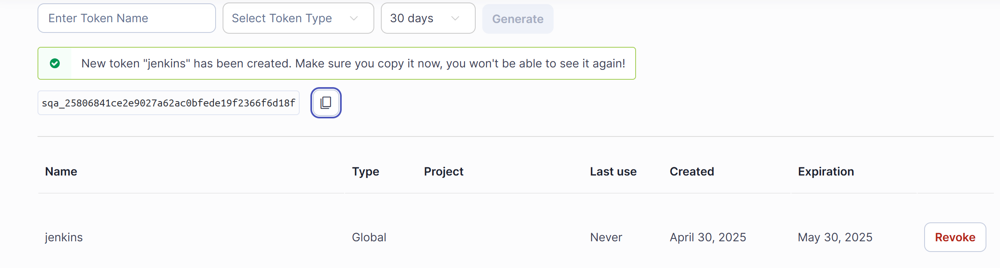
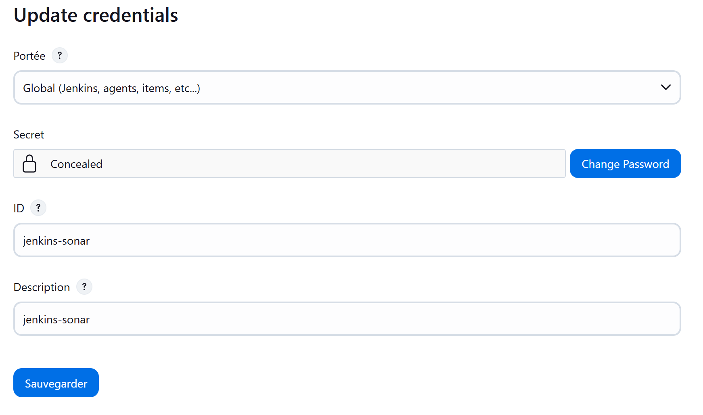
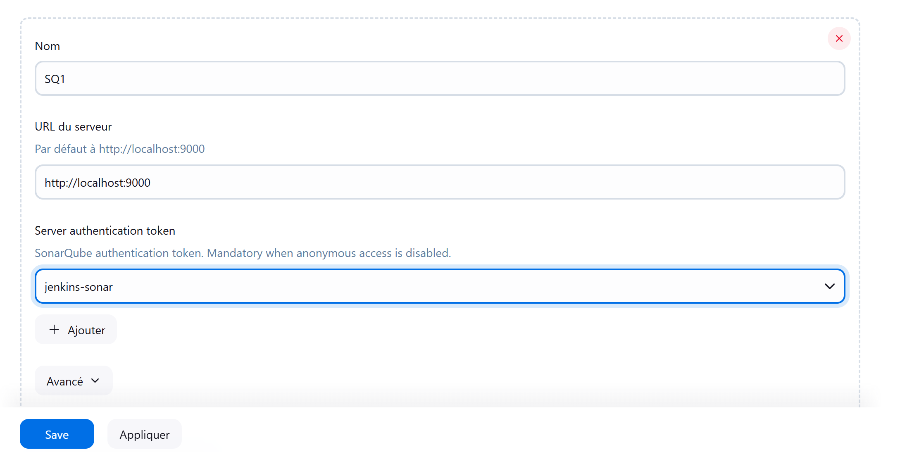
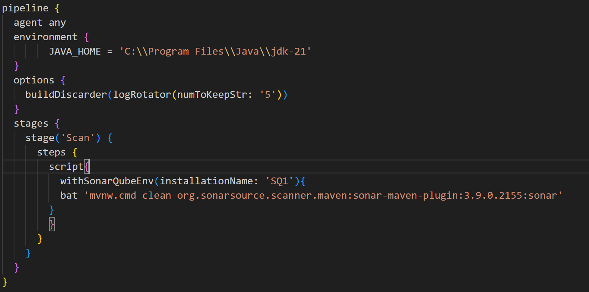
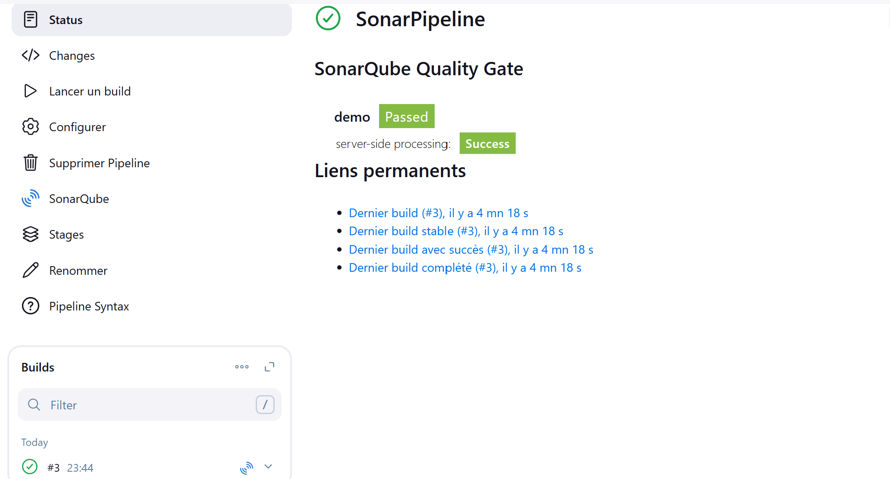
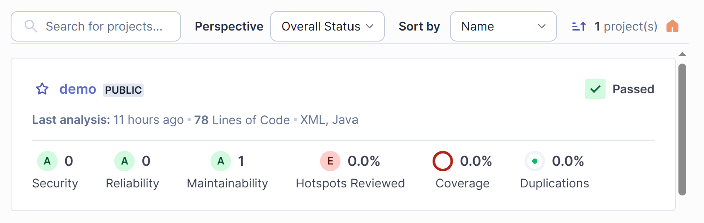
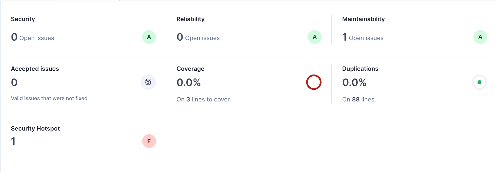
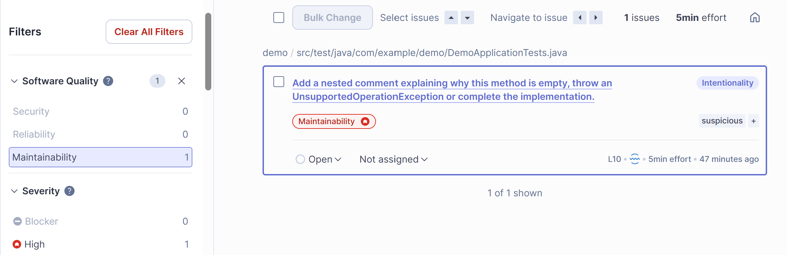
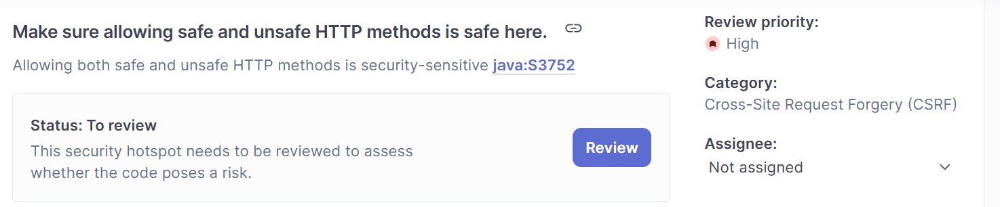

# SonarQube Lab
- <strong><i style="color:#B45555"> Moutaouakil Mohamed Amine </i></strong>

## Introduction
SonarQube est une plateforme d’analyse de la qualité du code qui permet aux développeurs de détecter et corriger les problèmes de code tels que les bugs, les vulnérabilités, les mauvaises pratiques de codage et les problèmes de maintenabilité. SonarQube évalue plusieurs aspects du code source pour garantir qu'il est de haute qualité et sécurisé. Ce fichier explore brièvement trois concepts clés dans SonarQube : la qualité du logiciel, la sévérité des problèmes et les attributs du code propre.

## Mesures de la qualité du code dans SonarQube

SonarQube mesure plusieurs critères pour évaluer la qualité du code d'une application. Voici une description brève des principaux filtres qu'il analyse :

- **Code Smells** : Ce sont des éléments du code qui peuvent fonctionner mais qui ne sont pas optimaux, comme des méthodes trop longues ou un manque de lisibilité.
- **Bugs** : Des erreurs potentielles dans le code qui peuvent entraîner des comportements inattendus ou des crashs.
- **Vulnérabilités** : Des failles de sécurité qui pourraient permettre des attaques ou des accès non autorisés au système.
- **Duplication** : Mesure de la répétition de code dans l’application, ce qui peut entraîner des difficultés de maintenance.
- **Test Coverage** : Le pourcentage de code testé par des tests unitaires, ce qui aide à évaluer la robustesse des tests.
- **Complexité** : Analyse de la complexité du code, ce qui inclut des mesures comme la complexité cyclomatique (nombre de chemins possibles dans un programme).

## Visualisation des Résultats SonarQube

#### Génération du token

#### Création du token pour envoyer les résultats au serveur SonarQube.

#### Ajout du token

#### Pipeline modifiée

#### Résultat du pipeline

#### Analyse de Sonarqube

#### Interprétation

> **An empty method is generally considered bad practice and can lead to confusion, readability, and maintenance issues. Empty methods bring no functionality and are misleading to others as they might think the method implementation fulfills a specific and identified requirement.**

Cette remarque signifie que :
- Une **méthode vide** est vue comme une **mauvaise pratique**.
- Elle **n'apporte aucune fonctionnalité** réelle.
- Elle **peut induire en erreur** les autres développeurs : ils pourraient croire que la méthode a un rôle précis ou qu’elle est déjà fonctionnelle.
- Cela nuit à la **lisibilité** du code et rend sa **maintenance plus difficile**.

✅ Pour éviter ce problème, il est recommandé :
- D’**ajouter un commentaire clair** si la méthode est vide intentionnellement,
- Ou de **compléter son implémentation**,
- Ou de **lancer une exception** pour signaler que la méthode n’est pas encore prête.

  

> **An HTTP method is safe when used to perform a read-only operation, such as retrieving information. In contrast, an unsafe HTTP method is used to change the state of an application, for instance to update a user’s profile on a web application.   Common safe HTTP methods are GET, HEAD, or OPTIONS.   Common unsafe HTTP methods are POST, PUT and DELETE.    Allowing both safe and unsafe HTTP methods to perform a specific operation on a web application could impact its security, for example CSRF protections are most of the time only protecting operations performed by unsafe HTTP methods.**

Cela signifie que :
- Une route accepte à la fois des méthodes HTTP sûres (comme GET) et non sûres (comme POST), ce qui peut entraîner une faille de sécurité.
- Par exemple, la suppression d’un utilisateur est accessible via **GET**, ce qui est dangereux. En effet, un simple lien ou une requête automatique (ex: image piégée, redirection) pourrait exécuter cette action sans protection.

✅ Bonne pratique recommandée :
- Restreindre l’accès uniquement à la méthode **POST** (ou DELETE, selon le cas),
- Protéger la route avec un **jeton CSRF**,
- Ne jamais utiliser **GET** pour des opérations qui modifient les données.

## Conclusion
SonarQube est un outil puissant pour évaluer la qualité du code et garantir que les logiciels développés respectent des normes de fiabilité, de sécurité et de maintenabilité. Grâce à des analyses détaillées des problèmes de code, des mesures de couverture et des vérifications de qualité, SonarQube aide les équipes à produire un code propre, sûr et performant.

